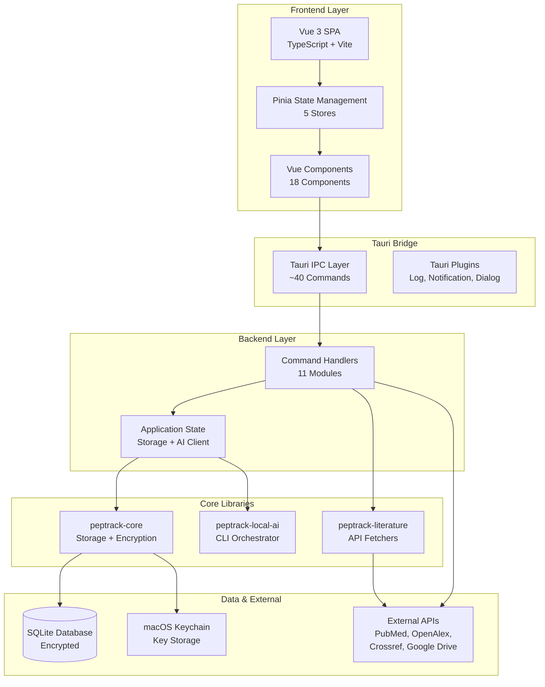
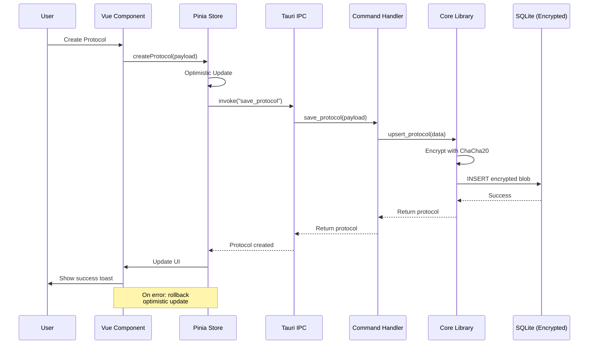

# PepTrack – Professional Peptide Management & Research Platform

**A secure, privacy-first desktop application for peptide protocol tracking, dose logging, and research management.**

PepTrack is a macOS-first desktop application built with Rust, Tauri, and Vue 3, featuring military-grade encryption, local AI integration, and comprehensive backup capabilities. All data stays local and encrypted—no cloud dependency required.

---

## 🎯 Current Capabilities

### Core Features
- **Protocol Management** - Create and manage peptide protocols with detailed tracking
- **Dose Logging** - Complete dose tracking with calendar views and history
- **Supplier & Inventory** - Track suppliers, manage vial inventory with expiry dates and batch tracking
- **Literature Search** - Integrated search across PubMed, OpenAlex, and Crossref APIs
- **Local AI Summaries** - Generate research summaries using local Codex or Claude CLI
- **Comprehensive Backup System**:
  - Manual and scheduled automatic backups (hourly/daily/weekly)
  - Google Drive OAuth integration for cloud backups
  - Backup compression, preview, and restore functionality
  - Automatic cleanup with configurable retention policies
- **Desktop Notifications** - Configurable notifications for backup events
- **Enterprise-Grade Security**:
  - ChaCha20-Poly1305 envelope encryption for all data
  - macOS Keychain integration for encryption keys
  - Automatic key migration from file-based storage
  - Zero telemetry or tracking

---

## 🏗️ Architecture Overview

### System Architecture



### Data Flow Architecture



### Encryption Pipeline

```mermaid
flowchart LR
    A[Raw Data<br/>JSON] --> B[Serialize to String]
    B --> C[Generate Random<br/>12-byte Nonce]
    C --> D[Get 32-byte Key<br/>from Keychain]
    D --> E[ChaCha20-Poly1305<br/>Encrypt]
    E --> F[Prepend Nonce<br/>to Ciphertext]
    F --> G[Store as BLOB<br/>in SQLite]

    G --> H[Read BLOB<br/>from SQLite]
    H --> I[Extract Nonce<br/>first 12 bytes]
    I --> J[Get Key<br/>from Keychain]
    J --> K[ChaCha20-Poly1305<br/>Decrypt]
    K --> L[Deserialize<br/>from String]
    L --> M[Rust Struct<br/>Decrypted Data]

    style E fill:#ff6b6b
    style K fill:#51cf66
```



---

## 💻 Tech Stack

### Backend (Rust)
| Technology | Version | Purpose |
|------------|---------|---------|
| **Rust** | 1.91.1 | Core application language |
| **Tauri** | 2.9.2 | Desktop app framework |
| **SQLite** | bundled | Local encrypted database |
| **ChaCha20-Poly1305** | 0.11.0-rc.2 | AEAD encryption |
| **Tokio** | 1.41.1 | Async runtime |
| **Reqwest** | 0.12 | HTTP client |
| **OAuth2** | 4.4 | Google Drive authentication |
| **Security-framework** | 2.11 | macOS Keychain integration |

### Frontend (Vue 3)
| Technology | Version | Purpose |
|------------|---------|---------|
| **Vue** | 3.5.24 | UI framework |
| **Vite** | 7.2 | Build tool & dev server |
| **TypeScript** | 5.9 | Type-safe JavaScript |
| **Pinia** | 3.0.4 | State management |
| **@vueuse/core** | 14.0.0 | Composition utilities |
| **Vitest** | 2.1.4 | Component testing |

### External APIs
- **PubMed** - Biomedical literature database
- **OpenAlex** - Scholarly works catalog
- **Crossref** - DOI metadata service
- **Google Drive** - OAuth 2.0 cloud backup

---

## 📁 Repository Structure

```
PepTrack/
├── frontend/                      # Vue 3 + Vite SPA
│   ├── src/
│   │   ├── App.vue               # Main application
│   │   ├── components/           # 18 Vue components
│   │   ├── stores/               # 5 Pinia stores
│   │   ├── composables/          # Vue composables
│   │   ├── api/                  # Tauri IPC wrappers
│   │   └── utils/                # Helper functions
│   ├── package.json              # Node dependencies
│   └── vitest.config.ts          # Test configuration
│
├── src-tauri/                     # Tauri application shell
│   ├── src/
│   │   ├── lib.rs               # App initialization
│   │   ├── state.rs             # AppState bootstrap
│   │   └── commands/            # 11 IPC command modules
│   │       ├── protocols.rs     # Protocol CRUD
│   │       ├── doses.rs         # Dose logging
│   │       ├── suppliers.rs     # Supplier & inventory
│   │       ├── ai.rs            # AI summarization
│   │       ├── literature.rs    # Literature search
│   │       ├── backup.rs        # Manual backups
│   │       ├── restore.rs       # Restore functionality
│   │       ├── scheduler_v2.rs  # Scheduled backups
│   │       └── drive.rs         # Google Drive OAuth
│   ├── Cargo.toml               # Rust dependencies
│   └── tauri.conf.json          # Tauri configuration
│
├── crates/                        # Rust library crates
│   ├── core/                     # Core functionality
│   │   └── src/
│   │       ├── db.rs            # SQLite StorageManager
│   │       ├── models.rs        # Domain types
│   │       ├── encryption.rs    # ChaCha20-Poly1305
│   │       ├── keychain.rs      # macOS Keychain
│   │       └── backup_encryption.rs
│   │
│   ├── local-ai/                 # Local AI integration
│   │   └── src/
│   │       └── lib.rs           # Codex/Claude orchestrator
│   │
│   └── literature/               # Literature APIs
│       └── src/
│           ├── pubmed.rs        # PubMed integration
│           ├── openalex.rs      # OpenAlex integration
│           └── crossref.rs      # Crossref integration
│
├── docs/                         # Technical documentation
│   ├── ARCHITECTURE.md          # Detailed architecture guide
│   ├── future_self.md           # Developer onboarding
│   └── ai_assistant_persona.md  # AI collaboration guide
│
├── README.md                     # This file
├── SETUP.md                      # User setup guide
├── TESTING.md                    # Testing scenarios
└── Cargo.toml                    # Workspace manifest
```

---

## 🚀 Getting Started

### Prerequisites

1. **Rust Toolchain**
   ```bash
   rustup default 1.91.1
   rustup component add rustfmt clippy
   cargo install tauri-cli --version 2.9.4
   ```

2. **Node.js** (≥ 22)
   ```bash
   node -v  # Should be 22+
   ```

3. **Optional: AI CLIs** (for summarization features)
   ```bash
   # Option 1: Codex CLI (recommended)
   npm install -g codex-cli

   # Option 2: Claude CLI (fallback)
   curl https://code.claude.com/install.sh | bash
   ```

### Installation

1. **Clone the repository**
   ```bash
   git clone https://github.com/your-username/PepTrack.git
   cd PepTrack
   ```

2. **Install frontend dependencies**
   ```bash
   cd frontend
   npm install
   cd ..
   ```

3. **Run in development mode**
   ```bash
   cargo tauri dev
   ```

### Development Workflow

```bash
# Format code
cargo fmt

# Lint with clippy
cargo clippy --workspace --all-targets

# Run Rust tests
cargo test --workspace

# Build frontend
cd frontend && npm run build

# Run frontend tests
cd frontend && npm run test -- --run

# Build production release
cargo tauri build
```

---

## 🔒 Data & Security

### Data Storage
- **Location**: `~/Library/Application Support/PepTrack/`
- **Database**: `peptrack.sqlite` (encrypted)
- **Encryption Keys**: Stored in macOS Keychain (primary) or `peptrack.key` (fallback)

### Encryption Details
- **Algorithm**: ChaCha20-Poly1305 (AEAD)
- **Key Size**: 32 bytes (256-bit)
- **Nonce**: 12 bytes, randomly generated per record
- **Key Storage**: macOS Keychain with automatic migration from file-based storage

### Privacy Guarantees
- ✅ All data encrypted at rest
- ✅ No telemetry or analytics
- ✅ No cloud sync without explicit user action
- ✅ No data leaves your computer except:
  - Research searches to PubMed/OpenAlex/Crossref (search queries only)
  - AI summaries to your local CLI (your credentials)
  - Google Drive backups to YOUR Google Drive (optional, user-initiated)

---

## 📚 Documentation

- **[SETUP.md](SETUP.md)** - Complete setup guide for optional features
- **[TESTING.md](TESTING.md)** - Comprehensive testing scenarios
- **[docs/ARCHITECTURE.md](docs/ARCHITECTURE.md)** - Detailed architecture documentation
- **[docs/future_self.md](docs/future_self.md)** - Developer onboarding guide

---

## 🗺️ Roadmap

### Completed ✅
- ✅ Protocol management with full CRUD operations
- ✅ Dose logging with calendar views
- ✅ Supplier & inventory management
- ✅ Literature search (PubMed, OpenAlex, Crossref)
- ✅ Local AI summarization (Codex/Claude)
- ✅ Manual and scheduled backups
- ✅ Google Drive OAuth integration
- ✅ macOS Keychain integration
- ✅ Desktop notifications
- ✅ Comprehensive error handling

### In Progress 🚧
- Background reminders for dose schedules
- Vial expiry notifications

### Planned 📋
- Cloud restore (restore directly from Google Drive)
- Multi-cloud support (Dropbox, OneDrive)
- Backup encryption with user-managed passwords
- Dashboard with usage analytics
- Data export (CSV/JSON)
- Keyboard shortcuts for power users

---

## 🤝 Contributing

### Quick Start for Contributors

1. Read [docs/future_self.md](docs/future_self.md) for environment setup
2. Check [TESTING.md](TESTING.md) for testing requirements
3. Follow the coding standards in [docs/ai_assistant_persona.md](docs/ai_assistant_persona.md)

### Development Guidelines

- **Rust**: Follow Rust 2021 edition best practices, use `anyhow` for errors
- **Vue/TypeScript**: Use Composition API, 2-space indent, PascalCase components
- **Testing**: All new features require tests
- **Documentation**: Update relevant docs with any changes

---

## 📄 License

[Add your license here]

---

## 🙏 Acknowledgments

Built with:
- [Tauri](https://tauri.app/) - Desktop app framework
- [Vue.js](https://vuejs.org/) - Progressive JavaScript framework
- [Rust](https://www.rust-lang.org/) - Systems programming language
- [Pinia](https://pinia.vuejs.org/) - Vue state management

---

**PepTrack** - Your peptides, your data, your control. 🧪
