# PepTrack - Architecture Documentation

**Last Updated:** 2025-11-11
**Version:** 1.0.0
**Target Platform:** macOS (Linux/Windows support experimental)

---

## Table of Contents

1. [System Overview](#system-overview)
2. [Architecture Diagrams](#architecture-diagrams)
3. [Component Details](#component-details)
4. [Data Models](#data-models)
5. [Security Architecture](#security-architecture)
6. [State Management](#state-management)
7. [API Integration](#api-integration)
8. [Backup System](#backup-system)
9. [Performance Considerations](#performance-considerations)
10. [Future Enhancements](#future-enhancements)

---

## System Overview

PepTrack is a desktop application built using a **Tauri + Rust + Vue 3** architecture, providing a secure, offline-first peptide management system with optional cloud backup capabilities.

### Core Principles

- **Privacy First**: All data encrypted locally, no telemetry
- **Offline-capable**: Core functionality works without internet
- **Security by Design**: Military-grade encryption (ChaCha20-Poly1305)
- **User Control**: Explicit consent for any data leaving the device

---

## Architecture Diagrams

### 1. High-Level System Architecture

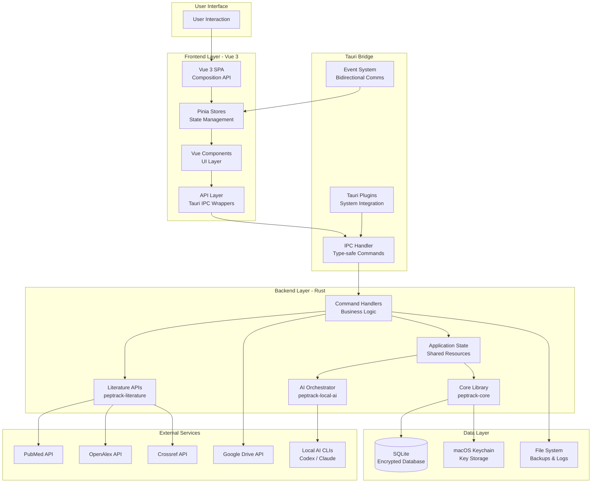

### 2. Data Flow - Protocol Creation

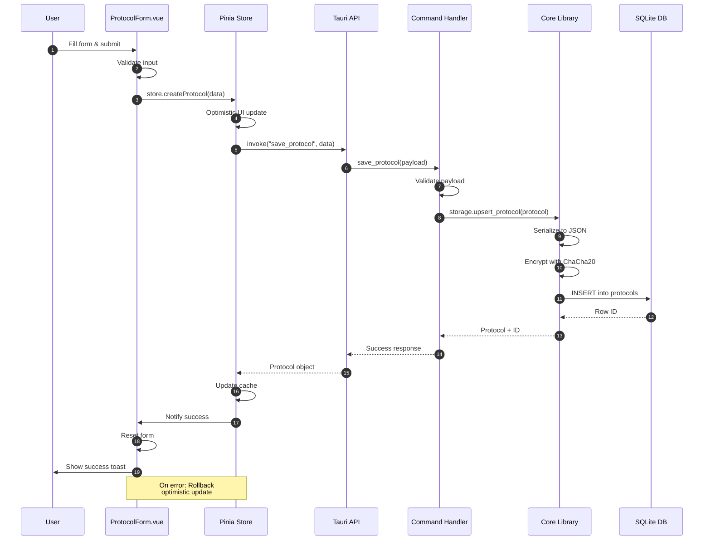

### 3. Encryption & Decryption Pipeline

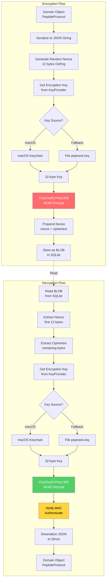

### 4. State Management Architecture

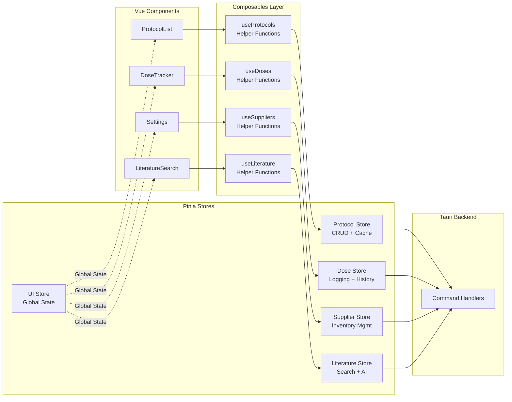

### 5. Backup System Architecture

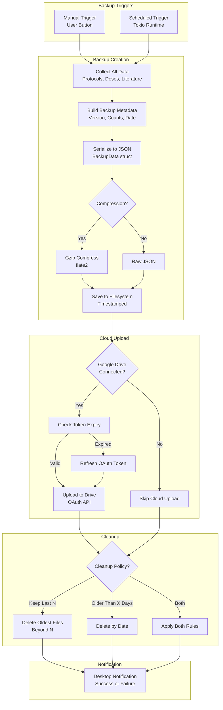

### 6. Literature Search Flow

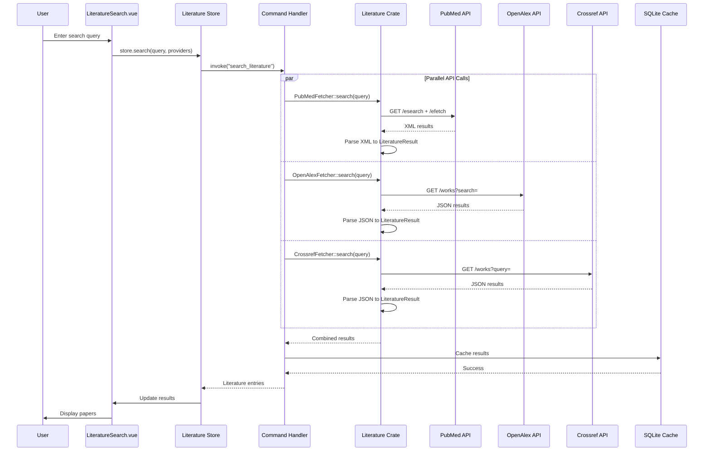

---

## Component Details

### Frontend Components

#### Core Components (18 total)

| Component | Purpose | Key Features |
|-----------|---------|--------------|
| `App.vue` | Main application shell | Tab navigation, view switching |
| `ProtocolList.vue` | Display protocols | Grid view, search, refresh |
| `ProtocolForm.vue` | Create/edit protocols | Form validation, ARIA labels |
| `DoseTracker.vue` | Log doses | Calendar view, history, filtering |
| `LiteratureSearch.vue` | Search papers | Multi-source search, caching |
| `AiSummaryPanel.vue` | AI summarization | Local CLI integration, format selection |
| `Settings.vue` | Settings container | Tab navigation, sub-settings |
| `BackupExport.vue` | Manual backups | Compression option, file save |
| `ScheduledBackup.vue` | Automated backups | Schedule config, cleanup policies |
| `GoogleDriveBackup.vue` | Cloud backup | OAuth flow, upload management |
| `RestoreBackup.vue` | Restore data | Preview, selective restore |
| `NotificationPreferences.vue` | Notification config | Granular controls |
| `SupplierManagement.vue` | Supplier CRUD | Contact info, notes |
| `InventoryManagement.vue` | Inventory tracking | Vial status, expiry alerts |
| `Toast.vue` | Toast notifications | Error/success messages |
| `LoadingSkeleton.vue` | Loading states | 4 variants, animated |
| `ErrorBoundary.vue` | Error handling | Graceful failures, retry |
| `WelcomeScreen.vue` | First-run onboarding | Feature intro |

### Backend Command Modules

#### Command Handlers (11 modules)

| Module | Commands | Purpose |
|--------|----------|---------|
| `protocols.rs` | `list_protocols`, `save_protocol`, `delete_protocol` | Protocol CRUD |
| `doses.rs` | `log_dose`, `list_dose_logs`, `list_dose_logs_for_protocol`, `delete_dose_log` | Dose management |
| `suppliers.rs` | `create_supplier`, `list_suppliers`, `update_supplier`, `delete_supplier`, `create_inventory_item`, `list_inventory`, `update_inventory_item`, `delete_inventory_item` | Supplier & inventory |
| `ai.rs` | `summarize_text`, `check_ai_availability` | AI integration |
| `literature.rs` | `search_literature`, `list_literature`, `search_cached_literature` | Literature search |
| `backup.rs` | `export_backup_data` | Manual backup creation |
| `restore.rs` | `preview_backup`, `restore_from_backup` | Backup restoration |
| `scheduler_v2.rs` | `update_backup_schedule`, `get_backup_schedule`, `get_backup_history`, `get_backup_progress`, `trigger_backup_now` | Scheduled backups |
| `drive.rs` | `start_drive_oauth`, `complete_drive_oauth`, `check_drive_status`, `upload_to_drive`, `disconnect_drive` | Google Drive integration |

---

## Data Models

### Core Domain Models

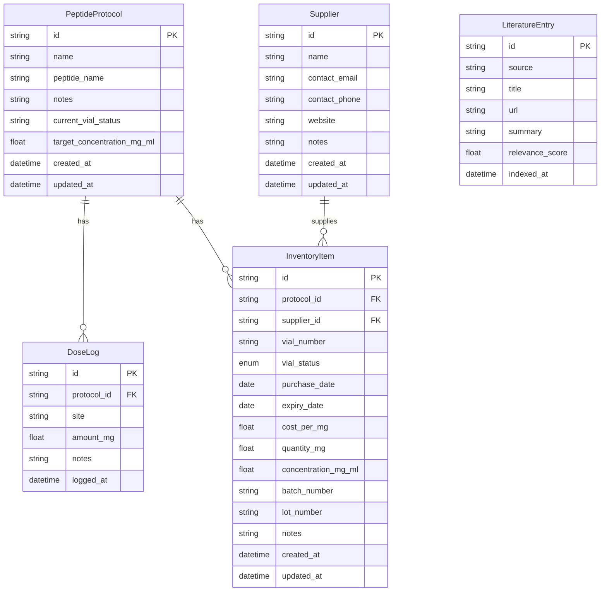

### Database Schema

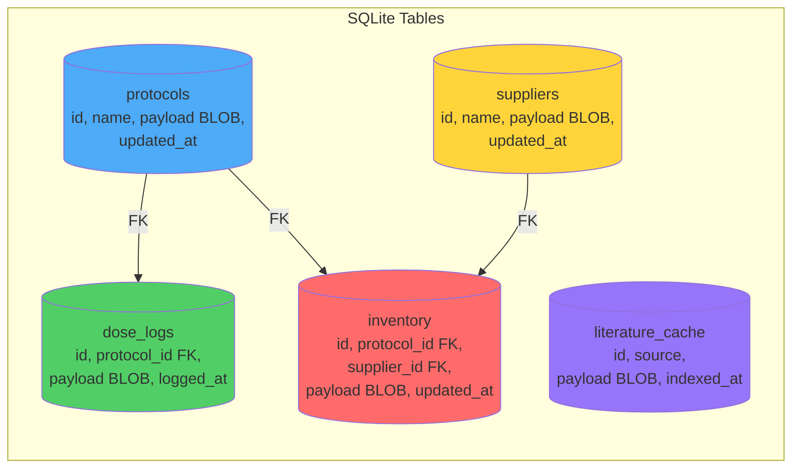

**Key Characteristics:**
- All sensitive data stored as encrypted BLOBs
- UUID primary keys (TEXT type)
- Foreign key constraints with CASCADE delete
- Indexes on timestamp columns for performance
- WAL mode enabled for concurrent access

---

## Security Architecture

### Threat Model

| Threat | Mitigation |
|--------|------------|
| **Data at rest** | ChaCha20-Poly1305 encryption with 12-byte random nonces |
| **Key compromise** | macOS Keychain storage, OS-level encryption |
| **Data in transit** | HTTPS for all external APIs, OAuth PKCE for Google Drive |
| **Unauthorized access** | No network-accessible interfaces, local-only app |
| **Memory attacks** | Zeroize sensitive data, secure memory clearing |
| **Replay attacks** | Unique nonces per record, timestamp validation |

### Encryption Key Lifecycle

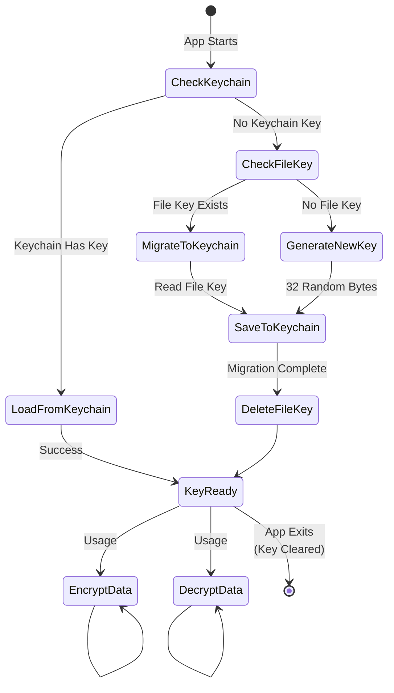

### OAuth Security (Google Drive)

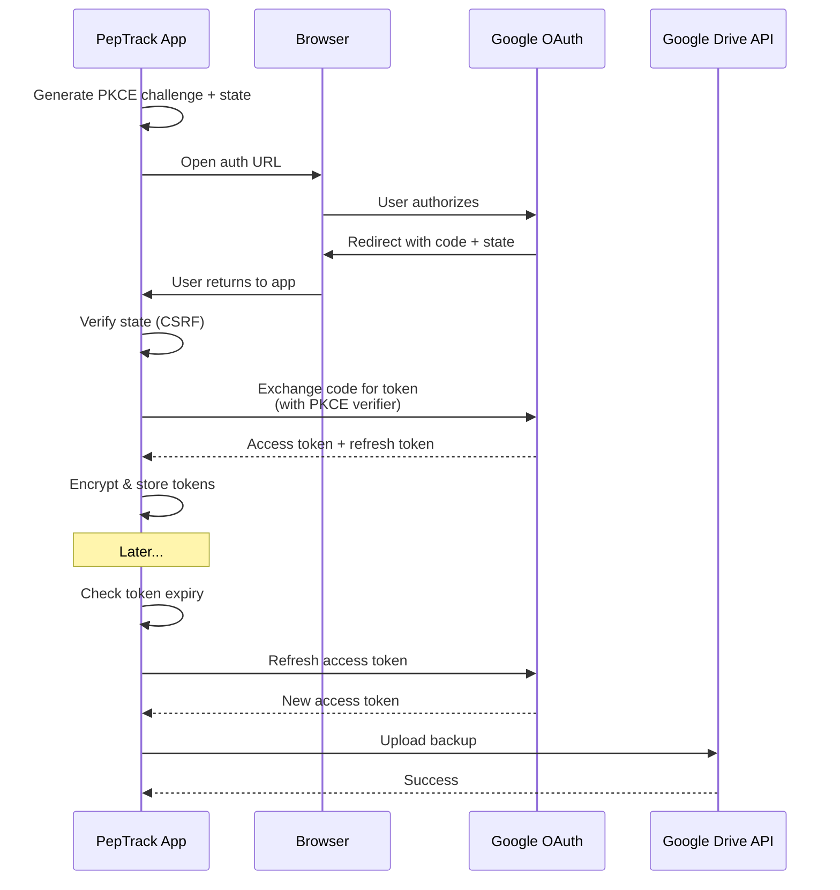

---

## State Management

### Pinia Store Architecture

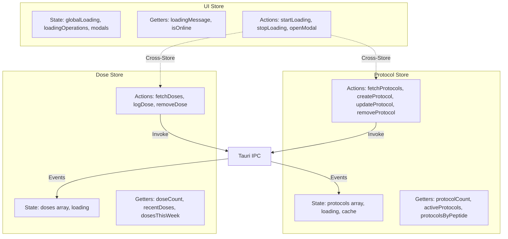

### Caching Strategy

**Protocol Store:**
- Cache duration: 30 seconds
- Cache invalidation: Automatic on mutations
- Force refresh: Available via `fetchProtocols(true)`
- Cache key: Timestamp of last fetch

**Dose Store:**
- Per-protocol caching
- Invalidation: On dose creation/deletion
- Refresh: Automatic when switching protocols

**Literature Store:**
- Search results: Session-scoped cache
- Cached papers: Persistent in SQLite
- No automatic expiration (user-initiated clear)

---

## API Integration

### External API Specifications

#### PubMed

```
Base URL: https://eutils.ncbi.nlm.nih.gov/entrez/eutils/
Endpoints:
  - esearch.fcgi: Search for articles
  - efetch.fcgi: Fetch article details
Rate Limit: 3 requests/second (unauthenticated)
Response Format: XML
```

#### OpenAlex

```
Base URL: https://api.openalex.org/
Endpoints:
  - /works?search={query}
Rate Limit: 100,000 requests/day
Response Format: JSON
```

#### Crossref

```
Base URL: https://api.crossref.org/
Endpoints:
  - /works?query={query}
Rate Limit: 50 requests/second
Response Format: JSON
```

#### Google Drive

```
Base URL: https://www.googleapis.com/
Endpoints:
  - /oauth2/v4/token: Token management
  - /drive/v3/files: File upload
  - /drive/v3/about: User info
Authentication: OAuth 2.0 with PKCE
Scopes: drive.file (limited access)
```

---

## Backup System

### Backup File Format

```typescript
interface BackupData {
  metadata: {
    export_date: string;          // ISO 8601
    protocols_count: number;
    doses_count: number;
    literature_count: number;
    app_version: string;          // e.g., "1.0.0"
  };
  protocols: PeptideProtocol[];
  dose_logs: DoseLog[];
  literature: LiteratureEntry[];
  suppliers?: Supplier[];          // Optional, newer versions
  inventory?: InventoryItem[];     // Optional, newer versions
}
```

### Backup Naming Convention

```
Format: peptrack_backup_{timestamp}.{extension}
Examples:
  - peptrack_backup_2025-11-11_14-30-45.json
  - peptrack_backup_2025-11-11_14-30-45.json.gz

Timestamp: YYYY-MM-DD_HH-mm-ss (24-hour format)
Extensions:
  - .json: Uncompressed
  - .json.gz: Gzip compressed
```

### Scheduled Backup Flow

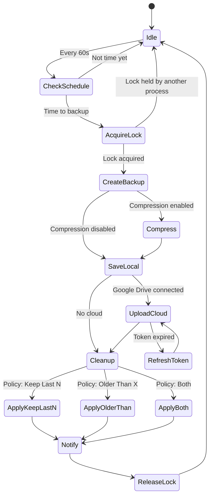

---

## Performance Considerations

### Frontend Optimizations

1. **Smart Caching**: 30-second TTL on protocol/dose data
2. **Optimistic Updates**: Immediate UI feedback with rollback on error
3. **Virtual Scrolling**: Ready for implementation when lists exceed 100+ items
4. **Lazy Loading**: Components loaded on-demand
5. **Debounced Search**: 300ms debounce on search inputs
6. **Loading Skeletons**: Perceived performance improvement

### Backend Optimizations

1. **SQLite WAL Mode**: Concurrent reads during writes
2. **Prepared Statements**: Reusable query compilation
3. **Indexed Queries**: Timestamps and foreign keys indexed
4. **Async I/O**: All file/network operations non-blocking
5. **Connection Pooling**: Single shared connection with mutex
6. **Batch Operations**: Bulk inserts for backup restoration

### Memory Management

1. **Zeroize**: Sensitive data cleared from memory
2. **Stream Processing**: Large files streamed, not loaded entirely
3. **Bounded Channels**: Prevent unbounded memory growth
4. **Arc/Mutex**: Shared state with minimal cloning

---

## Future Enhancements

### Planned Features

1. **Background Reminders**
   - LaunchAgent for macOS
   - Dose schedule notifications
   - Vial expiry alerts

2. **Cloud Restore**
   - List backups from Google Drive
   - Preview before download
   - Selective restore

3. **Multi-Cloud Support**
   - Dropbox integration
   - OneDrive integration
   - Provider abstraction layer

4. **Advanced Analytics**
   - Usage statistics dashboard
   - Cost tracking over time
   - Peptide efficacy tracking

5. **Data Export**
   - CSV export for protocols/doses
   - PDF reports
   - Excel-compatible formats

6. **Collaboration**
   - Export/import for data sharing
   - Anonymized data export
   - Protocol templates

---

## Appendix

### Build Artifacts

```
Production Build:
├── PepTrack.app (macOS)
│   ├── Contents/
│   │   ├── MacOS/
│   │   │   └── PepTrack (binary)
│   │   ├── Resources/
│   │   │   └── assets/ (HTML/CSS/JS)
│   │   └── Info.plist
└── PepTrack.dmg (installer)

Development Build:
└── target/
    ├── debug/
    │   └── peptrack (binary)
    └── release/
        └── peptrack (optimized binary)
```

### Environment Variables

```bash
# Optional: Enable debug logging
RUST_LOG=peptrack=debug,peptrack_core=debug

# Optional: Override data directory
PEPTRACK_DATA_DIR=~/custom/path

# Optional: AI CLI paths
CODEX_CLI_PATH=/usr/local/bin/codex
CLAUDE_CLI_PATH=/usr/local/bin/claude
```

### Testing Checklist

- [ ] All Rust unit tests pass (`cargo test --workspace`)
- [ ] Frontend tests pass (`npm run test`)
- [ ] Clippy produces no warnings (`cargo clippy --workspace`)
- [ ] Frontend builds without errors (`npm run build`)
- [ ] Manual smoke tests:
  - [ ] Create protocol
  - [ ] Log dose
  - [ ] Search literature
  - [ ] Manual backup
  - [ ] Scheduled backup
  - [ ] Google Drive upload
  - [ ] Restore backup
  - [ ] AI summarization

---

**Document Version:** 1.0.0
**Last Review:** 2025-11-11
**Maintainer:** PepTrack Team
