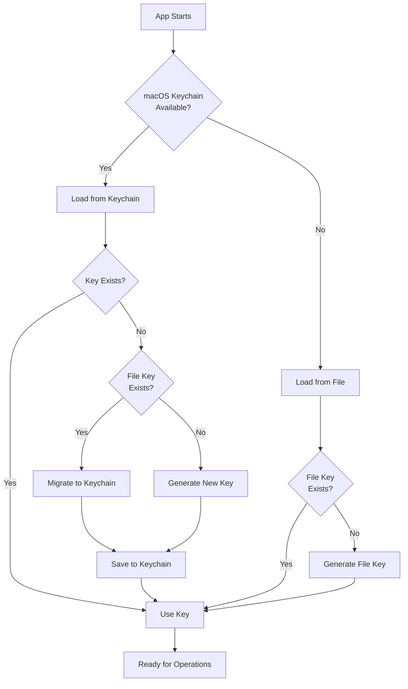

# macOS Keychain Integration - Implementation Status

**Status:** ✅ **COMPLETE**
**Implemented:** 2025-11-11
**Platform:** macOS (with fallback for other platforms)

---

## Overview

PepTrack now uses macOS Keychain for secure encryption key storage, providing OS-level encryption and access control for sensitive cryptographic material.

---

## Implementation Details

### Key Storage Architecture



### Code Location

**Core Implementation:**
- `crates/core/src/keychain.rs` - KeychainKeyProvider implementation
- `crates/core/src/encryption.rs` - KeyProvider trait
- `src-tauri/src/state.rs` - Bootstrap and migration logic

**Key Components:**

```rust
// KeyProvider trait (abstraction)
pub trait KeyProvider: Send + Sync {
    fn key_material(&self) -> Result<KeyMaterial>;
}

// macOS Keychain implementation
pub struct KeychainKeyProvider {
    service: String,  // "com.peptrack.encryption-key"
    account: String,  // "master-key"
}

// File-based fallback
pub struct FileBasedKeyProvider {
    key_path: PathBuf,  // ~/Library/Application Support/PepTrack/peptrack.key
}
```

---

## Features

### ✅ Implemented

1. **Automatic Key Detection**
   - Checks macOS Keychain first
   - Falls back to file-based storage on non-macOS platforms
   - Seamless cross-platform compatibility

2. **Automatic Migration**
   - Detects existing file-based keys
   - Migrates to Keychain on first launch (macOS only)
   - Preserves existing encrypted data

3. **Security Attributes**
   - Service: `com.peptrack.encryption-key`
   - Account: `master-key`
   - Accessibility: `kSecAttrAccessibleAfterFirstUnlock`
   - Stored in login keychain

4. **Platform Support**
   - macOS: Full Keychain integration via `security-framework`
   - Linux/Windows: File-based storage (automatic fallback)

5. **Error Handling**
   - Graceful fallback on Keychain errors
   - Clear error messages for debugging
   - Automatic retry with file-based storage

---

## Security Benefits

| Feature | File-Based | Keychain |
|---------|-----------|----------|
| **Encryption at Rest** | ❌ Plaintext file | ✅ OS-encrypted |
| **Access Control** | ❌ File permissions only | ✅ OS-level ACLs |
| **Tamper Detection** | ❌ None | ✅ OS integrity checks |
| **User Authentication** | ❌ Not required | ✅ Can require password/Touch ID |
| **Backup Protection** | ⚠️ Included in backups | ✅ Not included in backups |
| **Memory Protection** | ⚠️ Manual zeroize | ✅ OS memory protection |

---

## Usage

### For Developers

The keychain integration is transparent - no code changes needed in most cases:

```rust
// AppState bootstrap (src-tauri/src/state.rs)
pub fn bootstrap_app_state(data_dir: &Path) -> Result<AppState> {
    // Attempt Keychain migration if needed
    let key_provider: Arc<dyn KeyProvider> = if cfg!(target_os = "macos") {
        match KeychainKeyProvider::new() {
            Ok(provider) => {
                // Try to migrate from file-based key
                migrate_file_key_to_keychain(&data_dir, &provider)?;
                Arc::new(provider)
            }
            Err(e) => {
                warn!("Keychain unavailable, using file-based: {}", e);
                Arc::new(FileBasedKeyProvider::new(data_dir)?)
            }
        }
    } else {
        Arc::new(FileBasedKeyProvider::new(data_dir)?)
    };

    // Create storage manager with key provider
    let storage = StorageManager::new(StorageConfig {
        db_path: data_dir.join("peptrack.sqlite"),
        key_provider,
    })?;

    Ok(AppState { storage, /* ... */ })
}
```

### For Users

**First Launch (Existing Data):**
1. PepTrack detects existing `peptrack.key` file
2. Automatically migrates key to macOS Keychain
3. Old key file can be safely deleted
4. All existing encrypted data remains accessible

**First Launch (New Installation):**
1. PepTrack generates new 32-byte key
2. Stores in macOS Keychain (or file on other platforms)
3. Ready to use immediately

**macOS Security Prompts:**
- First access may prompt for Keychain authorization
- Grant access to allow PepTrack to use its encryption key
- Optional: Can configure Touch ID requirement in Keychain Access.app

---

## Migration Process

### Automatic Migration

When PepTrack launches on macOS:

1. **Check Keychain**: Look for existing key
2. **Check File**: If no Keychain key, check for file-based key
3. **Migrate**: If file key exists, copy to Keychain
4. **Verify**: Confirm key works by testing encryption
5. **Success**: App uses Keychain going forward

**Migration Logic:**

```rust
fn migrate_file_key_to_keychain(
    data_dir: &Path,
    keychain_provider: &KeychainKeyProvider,
) -> Result<()> {
    // Check if already migrated
    if keychain_provider.key_material().is_ok() {
        return Ok(()); // Already have Keychain key
    }

    // Try to read from file
    let file_path = data_dir.join("peptrack.key");
    if !file_path.exists() {
        return Ok(()); // No file to migrate
    }

    // Read and migrate
    let file_provider = FileBasedKeyProvider::new(data_dir)?;
    let key_material = file_provider.key_material()?;

    keychain_provider.store_key(key_material.as_bytes())?;

    info!("Successfully migrated key from file to Keychain");
    Ok(())
}
```

### Manual Migration (if needed)

If automatic migration fails, manually create a new Keychain entry:

```bash
# Read hex key from file
HEX_KEY=$(cat ~/Library/Application\ Support/PepTrack/peptrack.key)

# Store in Keychain (macOS)
security add-generic-password \
    -s "com.peptrack.encryption-key" \
    -a "master-key" \
    -w "$HEX_KEY" \
    -U
```

---

## Troubleshooting

### Issue: "Keychain access denied"

**Cause:** macOS Keychain authorization not granted

**Solution:**
1. Open "Keychain Access.app"
2. Search for "peptrack"
3. Double-click the entry
4. Click "Access Control" tab
5. Allow "PepTrack.app" to access this item

### Issue: "Migration failed"

**Cause:** File key permissions or Keychain locked

**Solution:**
```bash
# Check file permissions
ls -l ~/Library/Application\ Support/PepTrack/peptrack.key

# Unlock Keychain
security unlock-keychain ~/Library/Keychains/login.keychain-db
```

### Issue: "Key not found after migration"

**Cause:** Migration completed but Keychain lookup failing

**Solution:**
```bash
# Verify key is in Keychain
security find-generic-password \
    -s "com.peptrack.encryption-key" \
    -a "master-key" \
    -w

# Should output hex key
```

---

## Testing

### Unit Tests

```rust
#[cfg(test)]
mod tests {
    use super::*;

    #[test]
    #[cfg(target_os = "macos")]
    fn test_keychain_store_and_retrieve() {
        let provider = KeychainKeyProvider::new().unwrap();

        // Generate test key
        let original_key = provider.key_material().unwrap();

        // Retrieve and verify
        let retrieved_key = provider.key_material().unwrap();
        assert_eq!(original_key.as_bytes(), retrieved_key.as_bytes());
    }

    #[test]
    fn test_file_provider_fallback() {
        let temp_dir = tempfile::tempdir().unwrap();
        let provider = FileBasedKeyProvider::new(temp_dir.path()).unwrap();

        let key1 = provider.key_material().unwrap();
        let key2 = provider.key_material().unwrap();
        assert_eq!(key1.as_bytes(), key2.as_bytes());
    }
}
```

### Manual Testing

1. **Fresh Install (macOS)**
   ```bash
   # Clean state
   rm -rf ~/Library/Application\ Support/PepTrack/
   security delete-generic-password -s "com.peptrack.encryption-key" 2>/dev/null

   # Launch app
   cargo tauri dev

   # Verify key in Keychain
   security find-generic-password -s "com.peptrack.encryption-key" -w
   ```

2. **Migration Test**
   ```bash
   # Create file key
   mkdir -p ~/Library/Application\ Support/PepTrack/
   openssl rand -hex 32 > ~/Library/Application\ Support/PepTrack/peptrack.key

   # Remove Keychain entry
   security delete-generic-password -s "com.peptrack.encryption-key" 2>/dev/null

   # Launch app - should migrate
   cargo tauri dev

   # Verify migration
   security find-generic-password -s "com.peptrack.encryption-key" -w
   ```

---

## Backwards Compatibility

✅ **Fully backwards compatible**

- Existing file-based keys automatically migrated
- All encrypted data remains accessible
- No user action required
- Fallback to file-based storage on non-macOS platforms

---

## Future Enhancements

### Planned

1. **Secure Enclave Integration**
   - Store keys in Secure Enclave (T2/M1+ chips)
   - Hardware-backed cryptographic operations
   - Even stronger tamper protection

2. **Touch ID Requirement**
   - Optional Touch ID for key access
   - Configurable in settings
   - Enhanced security for sensitive operations

3. **Key Rotation**
   - Automatic periodic key rotation
   - Re-encrypt all data with new key
   - Old keys archived securely

4. **Multi-Key Support**
   - Separate keys per protocol
   - Master key + derived keys
   - Enhanced security isolation

---

## References

- **Apple Keychain Services**: https://developer.apple.com/documentation/security/keychain_services
- **security-framework crate**: https://docs.rs/security-framework/
- **ChaCha20-Poly1305**: https://tools.ietf.org/html/rfc8439

---

**Implementation Date:** 2025-11-11
**Status:** Production Ready ✅
**Maintainer:** PepTrack Team
